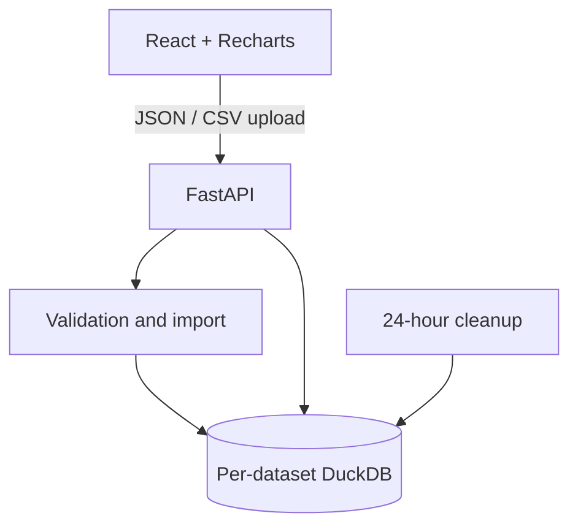

# Lightweight Sales Analytics — Product Specification

**Status:** MVP scope agreed  
**Project type:** Lightweight open-source case study for AI Dev Tools Zoomcamp  
**Working description:** Upload a predefined sales CSV, validate and analyze it with Python and DuckDB, and explore the results in a React/Recharts dashboard.

## 1. Product Summary

### Target user

A small e-commerce owner who can export completed order-line data as CSV and wants a quick view of recent sales performance without adopting a general-purpose BI platform.

### Core job to be done

> Upload my completed sales data and quickly understand what sold, when it sold, and how gross sales changed over time.

### Product goal

Deliver a focused, trustworthy path from CSV upload to a useful sales dashboard. The application should demonstrate clean product scoping, robust data validation, DuckDB analytics, a well-defined API, and a polished frontend.

### Important positioning

This is a sales analytics application, not a BI platform. The application itself does not need an AI feature. Its relevance to AI Dev Tools Zoomcamp is the development case study: specification-driven implementation, testing, evaluation, and use of AI development tools.

## 2. MVP User Journey

1. The user opens the application.
2. The user either:
   - uploads a CSV and selects its single currency; or
   - loads the bundled sample dataset.
3. The backend checks file limits and validates the complete dataset.
4. If validation fails, the entire upload is rejected and the UI shows a structured error report.
5. If validation succeeds, the backend imports only the six supported fields into a per-dataset DuckDB file and deletes the raw CSV.
6. The backend returns a dataset ID, a short-lived access token, dataset metadata, and the initial dashboard summary.
7. The user explores the dashboard and optionally changes the date range.
8. The dataset and its token expire after 24 hours and are deleted automatically.

## 3. Dataset Contract

### Dataset grain

One row represents one product line within one completed order.

If an order contains multiple units of the same product, the product must appear once for that order and the number of units must be expressed in `quantity`.

### Required columns

| Column | Logical type | Rules |
| --- | --- | --- |
| `order_id` | String | Required and non-empty. Used for distinct order counting. |
| `order_date` | Date | Required ISO calendar date in `YYYY-MM-DD` format. Must not be in the future. |
| `product_id` | String | Required and non-empty. Identifies the product. |
| `product_name` | String | Required and non-empty. One `product_id` must map to exactly one name within an upload. |
| `quantity` | Integer | Required and greater than zero. Zero and negative quantities are invalid. |
| `unit_price` | Decimal | Required and non-negative. A zero price is accepted with a warning; a negative price is invalid. |

### File-level rules

- CSV contains completed sales only.
- The user selects one currency for the entire upload.
- Mixed-currency conversion is unsupported.
- The combination `(order_id, product_id)` must be unique.
- `unit_price` may vary for the same product across different orders.
- All six required columns must exist.
- Additional columns are ignored with a warning and are never retained.
- A maximum of 50 MB and 500,000 data rows is accepted per upload.
- The MVP uses a strict predefined schema and does not provide column mapping.

### Derived field

```text
line_gross_sales = quantity × unit_price
```

The product should call this measure **gross sales**, not accounting revenue. It excludes refunds, discounts, taxes, shipping, payment fees, and currency conversion.

### Recommended parsing defaults

These are implementation defaults rather than additional product features:

- UTF-8 encoded, comma-delimited CSV with one header row.
- Column names are matched exactly after trimming surrounding whitespace.
- IDs and product names are treated as strings, even when they look numeric.
- Monetary calculations use an exact decimal type rather than binary floating point.
- Blank strings are treated as missing values.

## 4. Validation Behavior

### Policy

Validation is all-or-nothing. The application never silently drops invalid sales rows or calculates metrics from a partially accepted upload.

### Errors that reject an upload

- File exceeds the size or row limit.
- A required column is absent.
- A required value is blank or cannot be parsed.
- `order_date` is not exactly `YYYY-MM-DD` or is in the future.
- `quantity` is not a positive integer.
- `unit_price` is negative or invalid.
- `(order_id, product_id)` occurs more than once.
- One `product_id` maps to conflicting product names.

### Warnings that do not reject an upload

- One or more additional columns were ignored.
- One or more completed line items have `unit_price = 0`.

### Error response requirements

The UI must show:

- a short summary of the failure;
- the affected CSV row number;
- the field, machine-readable error code, and human-readable reason;
- a limited preview of errors plus the total error count when errors are numerous.

The user corrects the CSV outside the application and uploads it again. In-browser data editing is not part of MVP.

## 5. Metrics and Dashboard

### KPI cards

| Metric | Definition |
| --- | --- |
| Gross sales | `SUM(quantity × unit_price)` |
| Orders | `COUNT(DISTINCT order_id)` |
| Units sold | `SUM(quantity)` |
| Average order value | `gross sales ÷ distinct orders` |

Average order value is zero when there are no orders in the selected date range.

### Sales trend

Gross sales are aggregated by time bucket. Granularity is selected automatically from the active date range:

- Up to 90 days: daily
- More than 90 days and up to 2 years: weekly
- More than 2 years: monthly

The UI clearly displays the active granularity.

### Top products

Products are ranked by gross sales for the active date range. The initial implementation should show the top 10 products in a Recharts horizontal bar chart, with gross sales as the primary value. A compact table may also show units sold and distinct order count without introducing a separate drill-down page.

### Date filtering

- The initial dashboard covers the full date range in the uploaded dataset.
- The user can set start and end dates within that range.
- All KPI cards, the sales trend, and top products update consistently.
- Period-over-period comparison is not part of MVP.

## 6. UX Scope

### Upload screen

- Briefly explains the supported use case.
- Provides a downloadable example CSV or visible schema reference.
- Accepts one CSV file.
- Requires a single currency selection.
- Shows the 50 MB / 500,000-row limits.
- Provides a **Try sample data** action.
- Shows an indeterminate processing state during the synchronous request.

### Validation failure state

- Keeps the user on the upload flow.
- Presents actionable errors and non-destructive warnings.
- Never implies that a partial dataset was imported.

### Dashboard screen

- Displays dataset date range, selected currency, row count, and expiry time.
- Displays four KPI cards, a sales trend chart, and top products.
- Provides a start/end date filter and reset action.
- Provides a clear action to analyze another file.
- Shows empty, loading, expired-dataset, unauthorized, and API-error states.

## 7. Architecture



### Components

- **Frontend:** React single-page application using Recharts.
- **Backend:** Python with FastAPI and a JSON REST API.
- **Analytics:** DuckDB SQL over a canonical line-item table.
- **Packaging:** One Docker image. FastAPI serves the compiled React assets and API from the same origin.
- **Runtime model:** One application instance using local temporary storage.

### Processing model

- Upload, validation, import, and initial summary execute synchronously.
- The UI displays an indeterminate progress state.
- Subsequent filtered dashboard requests query the retained DuckDB file.
- Background queues, job polling, streaming progress, and distributed workers are unnecessary for the agreed limits.

### Suggested API surface

| Method and path | Purpose |
| --- | --- |
| `POST /api/datasets` | Upload and validate a CSV, select currency, create the temporary dataset, and return initial summary and credentials. |
| `POST /api/datasets/sample` | Create or load a temporary dataset from the bundled sample. |
| `GET /api/datasets/{id}` | Return dataset metadata and availability. |
| `GET /api/datasets/{id}/analytics?start=&end=` | Return KPI values, trend buckets, and top products for the active range. |
| `DELETE /api/datasets/{id}` | Let the current browser session delete its dataset early. |
| `GET /api/health` | Container health check without exposing dataset data. |

All dataset-specific requests require the short-lived access token. The exact endpoint layout can change during implementation without changing product scope.

## 8. Persistence and Lifecycle

- Each accepted upload receives an unguessable dataset ID.
- The raw CSV exists only while it is being validated and imported.
- After successful import, only a canonical per-dataset DuckDB file remains.
- Failed imports leave no durable dataset behind.
- The DuckDB file records selected currency, creation time, expiration time, and the hash of its access token as metadata.
- Dataset lifetime is 24 hours.
- Cleanup runs on application startup and periodically while the container is running.
- The user may delete the dataset before expiry.
- Container restart survival is best-effort only and depends on whether its temporary directory is mounted. Durable history is not promised.

## 9. Security and Privacy

### Access model

- There are no user accounts in MVP.
- Dataset ID is a locator, not a credential.
- A separate cryptographically random bearer token is returned after successful upload.
- The frontend holds the token in browser session storage and sends it in an authorization header.
- The server stores only a token hash.
- Dataset and token expire together.

### Required controls

- Enforce request-size and row-count limits server-side.
- Generate server-side storage paths; never use the uploaded filename as a path.
- Accept CSV only and reject malformed content.
- Use parameterized SQL for filter values.
- Validate date filters and constrain them to the dataset range.
- Do not log bearer tokens, CSV contents, product names, order IDs, or complete validation rows.
- Retain only the six documented columns.
- Use same-origin frontend/API deployment and restrictive CORS defaults.
- Apply private filesystem permissions to temporary dataset files.
- Delete temporary input and partial output after both success and failure.

### Hosted demo policy

- The public hosted demo uses bundled synthetic sample data only.
- It does not accept arbitrary file uploads.
- Full upload functionality is available in the self-hosted Docker application.

## 10. Sample Dataset

Provide a deterministic synthetic e-commerce dataset with:

- 12 months of history;
- approximately 10,000 distinct orders;
- 25–50 products;
- multiple line items in some orders;
- uneven product popularity;
- weekly and seasonal sales patterns;
- price variation across orders;
- no personal customer data.

The generator should accept a fixed random seed so tests and screenshots remain reproducible. Its output must satisfy the same contract as a user upload.

## 11. Deployment and Operations

- Publish one self-contained Docker image.
- Support a single command for local startup.
- Use environment variables for the temporary dataset directory, TTL, maximum upload size, maximum rows, and public-demo mode.
- Public-demo mode disables the arbitrary upload endpoint at the server, not only in the UI.
- Provide a health endpoint and structured operational logs that exclude sales data.
- Horizontal scaling, shared storage, and multi-instance coordination are explicitly outside MVP.

## 12. Testing and Quality Bar

### Unit tests

- Every validation rule and warning.
- Metric formulas, including multi-line orders and varying prices.
- Date-range boundaries and automatic trend granularity.
- Token verification and expiry logic.

### Integration tests

- Successful CSV upload through DuckDB import.
- Rejected upload leaves no retained dataset.
- Filtered analytics return consistent KPIs, trends, and product rankings.
- Missing or invalid tokens cannot read or delete a dataset.
- Expired datasets become inaccessible and are cleaned up.
- Public-demo mode rejects arbitrary uploads.

### Browser test

One stable end-to-end happy path:

1. Load sample data or upload a valid fixture.
2. Reach the dashboard.
3. Verify core metrics and charts render.
4. Change the date range.
5. Verify the dashboard updates.

GitHub Actions should run backend tests, frontend tests, linting/type checks, and the selected browser test.

## 13. MVP Boundaries

### Included

- Predefined CSV contract
- One completed-sales dataset per upload
- Single currency selection
- Strict validation with actionable error reporting
- Temporary canonical DuckDB storage
- Token-protected dataset access
- Four KPIs
- Automatically bucketed gross-sales trend
- Top products by gross sales
- Date-range filtering
- Deterministic sample dataset
- React/Recharts frontend
- FastAPI/DuckDB backend
- Single Docker image
- Focused automated test pyramid and CI
- Public sample-only demo mode

### Explicit non-goals

- User accounts and multi-tenancy
- Permanent datasets or saved dashboards
- Multiple files, file merging, or incremental uploads
- Shopify, Stripe, WooCommerce, database, or API connectors
- Returns, cancellations, discounts, taxes, shipping, fees, or net-revenue accounting
- Mixed-currency data or exchange-rate conversion
- Column mapping, spreadsheet editing, or general data transformation
- Customer analytics or storage of customer PII
- Forecasting, anomaly detection, recommendations, or AI-generated insights
- Custom charts, arbitrary metrics, SQL editing, or dashboard building
- Period-over-period comparison
- Report export or shareable dashboards
- Real-time streaming analytics
- Background job infrastructure
- Distributed deployment, shared storage, and horizontal scaling
- Native mobile applications

## 14. MVP Acceptance Criteria

The MVP is complete when all of the following are true:

1. A valid CSV within the agreed limits can be uploaded with a selected currency.
2. Every agreed validation error rejects the whole upload and produces an actionable report.
3. Extra columns and zero-price lines produce warnings without being retained or rejected.
4. A successful upload produces a protected temporary DuckDB dataset and removes the raw CSV.
5. The dashboard correctly renders gross sales, distinct orders, units, AOV, trend, and top products.
6. A date-range change updates all dashboard values consistently.
7. Trend granularity follows the agreed 90-day and 2-year thresholds.
8. Requests without a valid dataset token cannot access sales data.
9. A dataset is inaccessible after expiry and cleanup removes its file.
10. The application runs from one documented Docker command.
11. The public-demo configuration exposes sample data but rejects user uploads server-side.
12. The agreed unit, integration, and browser tests pass in CI.

## 15. Prioritized Backlog

### P0 — Foundation

- Create the repository structure for backend, frontend, and container packaging.
- Add FastAPI and React development workflows.
- Define the canonical DuckDB schema and exact decimal behavior.
- Add configuration for limits, TTL, storage path, and demo mode.
- Add a multi-stage Docker build that serves the compiled SPA through FastAPI.

### P0 — Dataset contract and sample data

- Document the six-column CSV contract with valid and invalid examples.
- Build the deterministic synthetic dataset generator.
- Add stable test fixtures for every validation rule.
- Provide a sample CSV download and a **Try sample data** action.

### P0 — Upload and validation

- Implement streamed request-size enforcement and temporary-file handling.
- Validate headers, types, missing values, dates, numeric bounds, uniqueness, and product-name consistency.
- Collect warnings for ignored columns and zero prices.
- Return structured, bounded error details with total counts.
- Guarantee cleanup of failed and partial imports.

### P0 — Temporary persistence and access

- Generate dataset IDs and bearer tokens.
- Store only token hashes and canonical data.
- Create the per-dataset DuckDB file and metadata.
- Authorize every dataset-specific API request.
- Implement explicit delete, expiry checks, startup cleanup, and periodic cleanup.

### P0 — Analytics API

- Implement KPI queries for a date range.
- Implement daily, weekly, and monthly sales aggregation.
- Apply automatic granularity thresholds.
- Implement top-10 product ranking by gross sales.
- Return consistent currency and date-range metadata.

### P0 — Frontend workflow

- Build the upload/currency/sample screen.
- Build processing, error, warning, and retry states.
- Build KPI cards, trend chart, and top-products visualization.
- Build the date-range filter and reset action.
- Handle expired, unauthorized, empty, and general error states.
- Make the core workflow responsive for desktop and tablet widths.

### P0 — Security, tests, and delivery

- Apply all required security and logging controls.
- Implement the focused unit and integration test suites.
- Add the single browser-level happy-path test.
- Configure GitHub Actions for tests, linting, type checking, and container build.
- Write the self-hosting README, architecture notes, privacy behavior, and known limitations.

### P1 — Post-MVP candidates

- Period-over-period comparison.
- Manual day/week/month trend selector.
- Downloadable aggregate CSV or PDF report.
- Return and cancellation support through an expanded schema.
- Preset adapters for common Shopify or WooCommerce exports.
- Durable authenticated workspaces and saved dashboards.
- Background processing for substantially larger files.

## 16. Decision Record

| Area | Decision |
| --- | --- |
| Target user | Small e-commerce owner |
| Core use case | Understand recent sales performance |
| Dataset grain | One row per order line item |
| Required schema | Six minimal fields |
| Currency | One selected currency per upload |
| Transaction scope | Completed sales only |
| Date format | `YYYY-MM-DD` |
| Metrics | Gross sales, orders, units, AOV, trend, top products |
| Initial range | Full dataset with date-range filtering |
| Invalid rows | Reject the entire upload |
| Duplicate rule | Unique `(order_id, product_id)` |
| Product identity | One name per product ID |
| Backend | FastAPI JSON API |
| Analytics | DuckDB |
| Persistence | Temporary, 24 hours |
| Stored data | Canonical DuckDB only; raw CSV removed |
| Packaging | Single Docker container |
| Scale limit | 50 MB / 500,000 rows |
| Processing | Synchronous upload request |
| Hosted demo | Synthetic sample data only |
| Extra columns | Ignore with warning and do not retain |
| Zero prices | Accept with warning |
| Future dates | Reject |
| Trend buckets | Automatic daily/weekly/monthly |
| Access | Dataset ID plus separate bearer token |
| Sample data | Deterministic synthetic dataset |
| Tests | Focused test pyramid in CI |
| MVP endpoint | Upload, validate, and explore dashboard |

